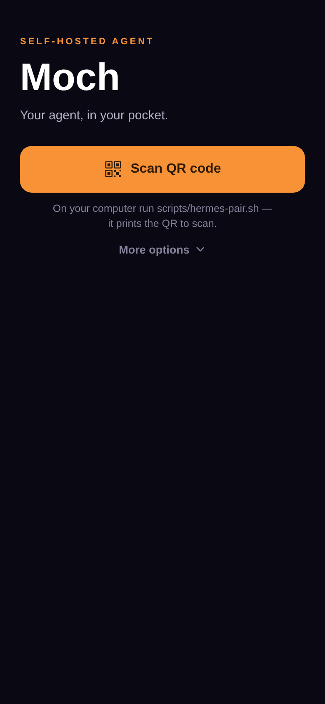
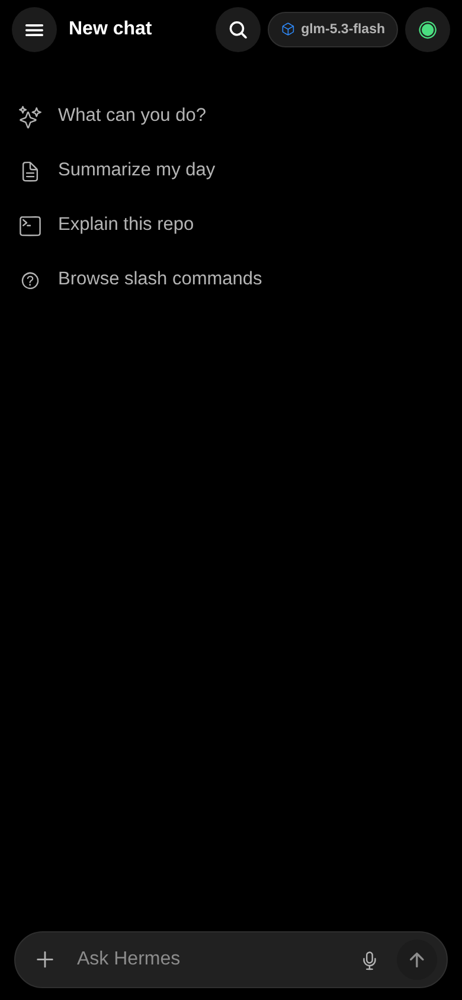
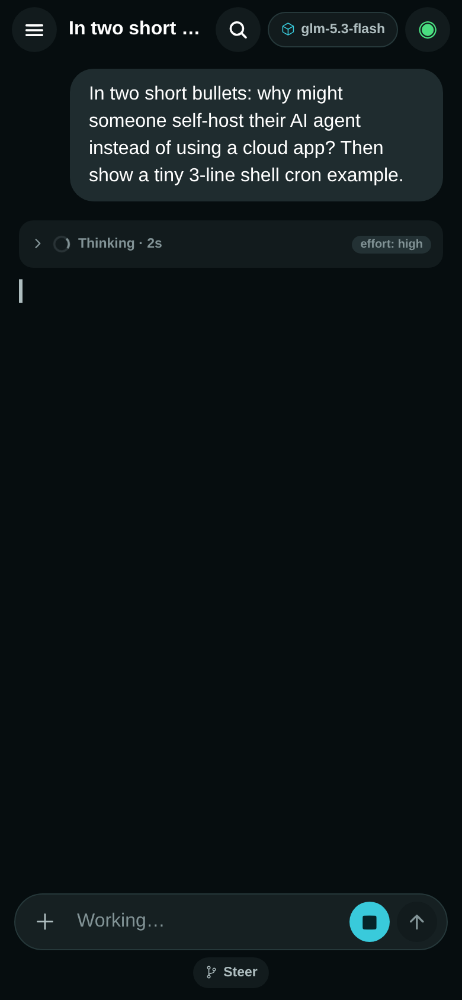
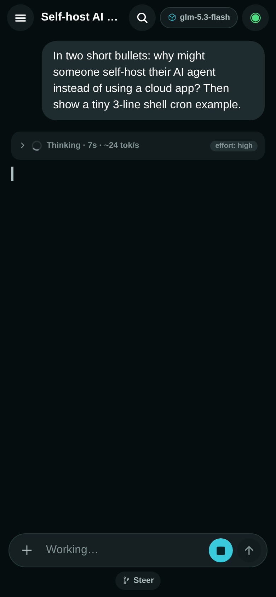
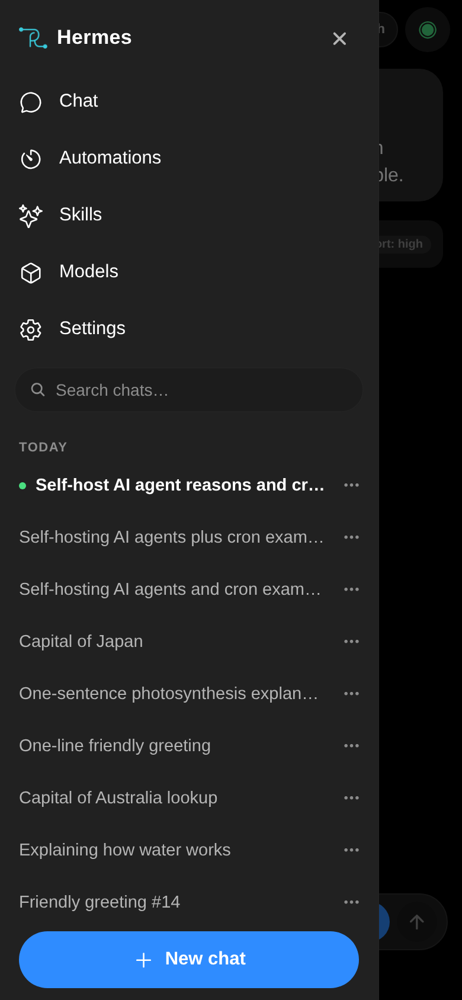
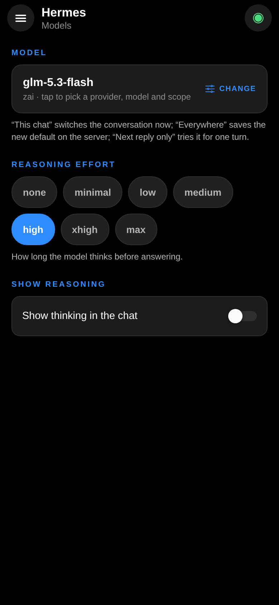
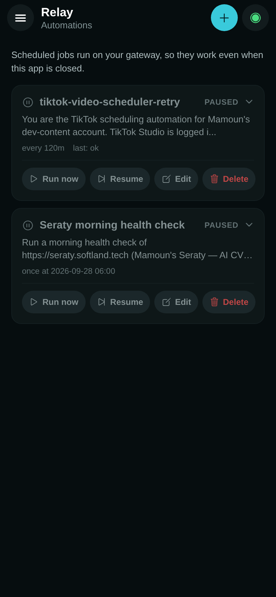
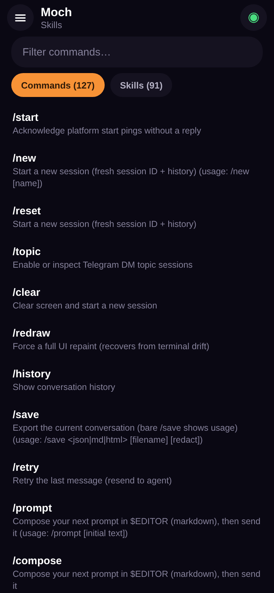
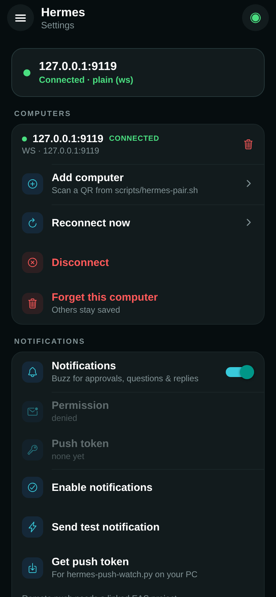

# Moch

**Website:** <https://softland-tech.github.io/Relay>

**Moch** is an open-source Expo (React Native) mobile client for a self-hosted Hermes agent gateway. It puts the agent that runs on your own computer in your pocket: streamed replies with live reasoning blocks, tool activity, approvals and questions you can answer from your phone, scheduled automations, voice in/out through your gateway's providers, and multi-computer pairing — all talking to *your* server over the same JSON-RPC protocol the desktop app uses. The gateway holds the keys and the sessions; the phone is just a very convenient window onto them.

## Screenshots

The web build at phone size, connected to a real gateway:

<table>
  <tr>
    <td></td>
    <td></td>
    <td></td>
  </tr>
  <tr>
    <td align="center"><sub>Pairing</sub></td>
    <td align="center"><sub>New chat</sub></td>
    <td align="center"><sub>Streaming + thinking</sub></td>
  </tr>
  <tr>
    <td></td>
    <td></td>
    <td></td>
  </tr>
  <tr>
    <td align="center"><sub>Rendered reply</sub></td>
    <td align="center"><sub>Sidebar & chat list</sub></td>
    <td align="center"><sub>Models & reasoning</sub></td>
  </tr>
  <tr>
    <td></td>
    <td></td>
    <td></td>
  </tr>
  <tr>
    <td align="center"><sub>Automations</sub></td>
    <td align="center"><sub>Commands & skills</sub></td>
    <td align="center"><sub>Settings</sub></td>
  </tr>
</table>

## Features

Everything below is what the client actually implements — nothing is hardcoded against a particular server beyond the gateway contract:

- **Streaming chat** — answers stream token-by-token; reasoning arrives as collapsible *Thinking* blocks inline with the answer (elapsed time, ~tok/s estimate, reasoning-effort chip), plus tool-call rows with status/duration, a todo list, and per-session token/cost usage. Markdown renders on completion, with copy and listen actions on every reply.
- **Answer the agent from your phone** — approvals, clarifications, sudo and secret requests arrive as interactive cards over the same socket. A question waiting in a background conversation shows as a badge instead of blocking the chat you're reading.
- **Multi-session** — every conversation is an independent session with its own messages, tools, thinking, todos and busy flag. A turn running in session A keeps streaming (with an activity dot in the list) while you read session B.
- **ChatGPT-style sidebar** — search across all chats (archive included), and pin / rename / archive / delete on every row. Chats group into **Pinned / Today / Yesterday / Previous 7 days / Older / Archived**; pin and archive are local marks that persist on the device, rename goes through the server so the auto-titler never overwrites it.
- **Multi-computer pairing** — pair more than one gateway (say, your desk and your laptop): every computer is remembered, the app reconnects to the last one on launch, and you switch or forget them from Settings → *Computers*. Pairing tokens go into the device keystore (SecureStore; AsyncStorage fallback where SecureStore is unavailable, e.g. web) — never into git.
- **Slash commands, from the server** — typing `/` in the composer drives off the gateway's own registry (`commands.catalog` + `complete.slash` ranking), so new server-side commands and skills appear without an app update. Commands the catalog marks as option-style (`/model`, `/reasoning`, `/fast`, …) open native pickers instead of usage text; `/model` switches provider → model → scope using the same string the gateway's own parser reads.
- **Automations** — the Hermes equivalent of "scheduled tasks": create, edit, pause/resume, delete and run-now for cron jobs (`cron.manage` + `/cron`), with schedules like `every 30m`, `in 45m`, or `every monday 9:00`. Jobs run on the gateway, so they fire even when the app is closed.
- **Models & reasoning** — a Models screen to pick provider/model/scope (*this chat* / *everywhere* / *next reply only*), set reasoning effort (`none` … `max`, applied live), and show/hide thinking in chat.
- **Voice via your gateway** — no audio API keys on the phone. The mic button records and transcribes through the server's STT (`POST /api/audio/transcribe`), dropping the transcript into the composer for review; *Listen* on a reply plays the server's TTS (`POST /api/audio/speak`), with on-device speech as fallback (e.g. formats iOS can't decode).
- **Notifications** — local alerts for approvals/questions/replies while the socket is alive and the app is backgrounded, and opt-in remote push for when the app is closed (see [Push for approvals](#push-for-approvals-optional)).
- **Resilience** — automatic reconnect with exponential backoff, lossless event replay per session, an offline outbox that flushes queued prompts on reconnect, and per-message retry on failed sends.

## Requirements

- **Node.js and npm** — SDK 57's documented runtime is Node 22.13.x (this repo pins no `engines` field; the figure comes from the versioned docs linked below)
- **Expo SDK 57** — this project tracks SDK 57 exactly (React Native 0.86 in this repo); read the versioned docs at <https://docs.expo.dev/versions/v57.0.0/> before writing any code (the SDK has changed substantially from earlier versions). Per those docs the platform floors are Android 7+ and iOS 16.4+.
- **A self-hosted Hermes gateway you control**, running and reachable from your phone (same LAN, VPN/tailnet, or public host). See the next section.
- Optional: `python3` with `qrcode` (+ `pillow`) or `qrencode` for terminal QR display during pairing; an [EAS](https://docs.expo.dev/eas/) build for remote push.

### The gateway

Moch is **client-only**: it has no built-in agent, models, or API keys. It speaks the gateway's JSON-RPC v7 protocol over WebSocket (`ws(s)://<your-gateway-host>:<port>/api/ws`) plus the dashboard REST audio endpoints.

The gateway is a separate self-hosted component that this repository does not ship. To get a server, set up Hermes yourself following the upstream project's README: <https://github.com/NousResearch/hermes-agent>. This README stays client-side — run the gateway on your own machine however that project documents, then come back here and pair this app with it. (The client's `src/protocol/` layer is a port of that project's shared client sources; the generated wire contract it implements is `apps/shared/src/gateway-contract.generated.ts` in the gateway repo.)

Two things from the server side matter to the phone:

- **The address** — `<host>:<port>` your gateway listens on. No default port is documented anywhere this README can point to — not in this repo, and not on the gateway repo's landing page — and the helper scripts in `scripts/` ship with *different* port defaults anyway (pairing defaults to `9999`, the push watcher to `127.0.0.1:9119`). Find the port in your own gateway configuration and pass it explicitly.
- **The dashboard session token** — the gateway's session token. The convention this repo's tooling assumes is `~/.config/hermes-serve.env` on the gateway host, containing a `HERMES_DASHBOARD_SESSION_TOKEN=<token>` line; the pairing script, the push watcher and the live test suites all read it from there, and one token serves all of them. The same token authenticates both transports the app uses: the WebSocket (`?token=…`) and the dashboard REST API (`X-Hermes-Session-Token` header). How your deployment issues that token is gateway-side configuration this repo neither ships nor documents — the gateway project's configuration/environment docs are the place to look.

**Compatibility:** the client speaks gateway protocol **v7**, implemented against the generated wire contract (`apps/shared/src/gateway-contract.generated.ts` in the gateway repo). This repository pins no gateway version range — run a gateway that speaks v7, and if the wire misbehaves, diff against that contract first.

All addresses, tokens and flags in the examples below are placeholders — substitute your own values.

## Getting started

Clone this repository, install, and start the dev server:

```sh
npm install
npx expo start        # press w / a / i, or scan with Expo Go
npm run web           # expo start --web
npm run android       # expo start --android (emulator or device via adb)
npm run ios           # expo start --ios     (requires macOS with Xcode)
```

**No gateway yet?** There is no demo or mock mode: without a reachable gateway the app stops at the onboarding/pairing screens. To exercise the *protocol layer* without a server, the offline suites each stand up a fake v7 gateway in plain node (`npm run test`, `npm run test:slash`, `npm run test:interactive`) — but the app's UI itself needs a real gateway to get past pairing.

### Expo Go vs a build

The app is written to run in **Expo Go** — `npm run test:imports` evaluates the real module graph under a simulated Android/Expo Go environment to keep it loadable. Chat, QR pairing and voice run there. The exceptions:

- **Notifications on Android in Expo Go** — `expo-notifications` cannot even load in Expo Go on Android since SDK 53, so neither local alerts nor remote push work there; use a development build (`npx expo run:android`, or EAS).
- **Remote push everywhere** — needs an EAS-linked development or production build on a physical device (see below).
- **The `hermes://connect` deep link** — custom URL schemes only work in development/production builds; Expo Go opens `exp://` links only. In Expo Go, pair with the in-app scanner or the paste field.

## Connecting to a gateway

Pairing needs three things: the **host** (`<gateway-host>:<gateway-port>`), the **dashboard session token**, and whether to use **TLS** (`wss`). The flow is QR-first; manual entry is the fallback.

### 1. Print a QR on the computer that runs the gateway

```sh
# LAN (plain ws):
./scripts/hermes-pair.sh --host <gateway-host> --port <gateway-port> --token <token>
# tailnet / public host (wss):
./scripts/hermes-pair.sh --host <gateway-host> --port <gateway-port> --token <token> --tls
```

- The token is the gateway's dashboard session token (see [The gateway](#the-gateway)); the script reads it from `HERMES_DASHBOARD_SESSION_TOKEN`/`HERMES_TOKEN`, prompts if missing, and accepts `host:port` inline in `--host` if you prefer. `--port` alone defaults to `9999` — pass your real port instead of trusting that.
- It always prints the connection summary, the `hermes://connect?host=…&token=…&tls=…` pairing link, and manual-entry values. The ASCII QR is printed only when a QR renderer is installed (`python3` + `qrcode`, or `qrencode`); without one the script degrades to link/manual-entry and tells you how to install a renderer — except with `--out qr.png`, which is an error without a renderer.

### 2. Scan it with the phone

Open Moch → **Scan QR code**. No camera, or pairing a link from elsewhere? **More options** folds out a paste-field for the `hermes://connect?…` link and a manual host + token + TLS form. On a development or production build, `hermes://connect` links tapped on the phone pair directly.

The token lands in SecureStore (AsyncStorage fallback where SecureStore is unavailable, e.g. web), and the paired computer is remembered.

### 3. Away from home Wi-Fi

The app reaches the gateway wherever the phone can reach the host:

- **Same network** — pair with the machine's LAN IP (plain `ws://`). Simplest, but only works at home.
- **Anywhere** — install [Tailscale](https://tailscale.com) (or your VPN of choice) on both machines and pair with the tailnet hostname + `--tls`. Works over mobile data and foreign Wi-Fi, no port forwarding, token encrypted in transit.
- Tip: pair the *same machine twice* — once via LAN IP, once via Tailscale — and both entries sit in *Computers* for one-tap switching.

## Push for approvals (optional)

Two layers:

1. **Local alerts (no setup).** While the socket is alive but the app is backgrounded, approvals / sudo / secrets / questions / replies raise a system notification. Tap → back to chat. Toggle in Settings. (Not available in Expo Go on Android — see [Expo Go vs a build](#expo-go-vs-a-build).)
2. **Remote push (app closed).** Needs a build with push credentials:
   - `npx eas init` in this directory, then `npx eas build` (a development build is enough). Expo Go cannot receive remote pushes on Android.
   - Push credentials live on the EAS project, per platform: iOS needs an APNs key; Android remote push needs its Google/FCM credentials uploaded there. The Expo push-setup docs cover both.
   - On the phone: Settings → **Get push token** (copies it). You can also use Settings → **Send test notification** to confirm the phone side works before wiring up the watcher.
   - On the gateway machine, keep the watcher running (systemd/tmux). It authenticates to the gateway with the same dashboard session token — pass `--token` or export `HERMES_DASHBOARD_SESSION_TOKEN`:

     ```sh
     ./scripts/hermes-push-watch.sh \
       --host 127.0.0.1:<gateway-port> \
       --token <token> \
       --push-token 'ExponentPushToken[xxxx]'
       # --replies     also push on every agent reply (noisy, off by default)
       # --interval 15 poll seconds (default 15)
     ```

     The watcher polls the gateway's lossless replay ring (`session.events.since` — read-only, steals no sessions) and forwards approvals/questions via Expo Push. First run seeds watermarks silently, so expect no notification until the next real approval; to check that the loop itself works, run it once with `--once` (single poll, then exit) and watch its log output. Its default host is `127.0.0.1:9119` — pass `--host <gateway-host>:<gateway-port>` to match your gateway.

## Project structure

```
app/                        # expo-router routes
  index.tsx                 #   onboarding: pair your first computer
  add-computer.tsx          #   pair an additional computer (modal)
  (tabs)/chat.tsx           #   the conversation screen
  (tabs)/sessions.tsx       #   Chats: search/open/delete conversations
  (tabs)/agent.tsx          #   Models: model picker, reasoning effort
  (tabs)/automations.tsx    #   cron jobs: create/edit/pause/run
  (tabs)/skills.tsx         #   slash commands + skills from the gateway
  (tabs)/settings.tsx       #   computers, notifications, diagnostics
src/
  components/               # Sidebar (drawer), Chat bubbles/thinking blocks,
                            #   PairForm (QR scan), ModelPickerSheet, ScreenShell
  lib/
    gateway.ts              #   connection lifecycle, reconnect, remembered
                            #   computers, token storage
    chat.ts                 #   session state, stream batching, event intake,
                            #   approvals/clarify/sudo/secret answers, outbox
    sessionList.ts          #   session.list bridge (stored vs live ids)
    chatListState.ts        #   pin/archive marks + section grouping
    slash.ts                #   command catalog, completions, dispatch
    modelState.ts           #   live model/provider tracking, model.options
    voice.ts / http.ts      #   STT/TTS via the gateway REST API
    push.ts                 #   local notifications + Expo push
    pairing.ts              #   hermes://connect link parse/build
  protocol/                 # JSON-RPC channel + WebSocket gateway client
                            #   (v7: server→client requests, seq/epoch replay)
scripts/
  hermes-pair.sh            # print pairing QR / link from the gateway host
  hermes-push-watch.sh|.py  # forward approvals to your phone via Expo Push
  test-*.ts                 # node-runnable test suites (see below)
```

## npm scripts

| Script | What it does |
| --- | --- |
| `start` | `expo start` — dev server for all platforms |
| `android` / `ios` / `web` | start targeting that platform |
| `typecheck` | `tsc --noEmit` for the app **and** the `scripts/` project |
| `test` | protocol suite against a fake v7 gateway — no server needed |
| `test:imports` | verify the app's import graph stays Expo Go–safe |
| `test:order` | session-list ordering against a **real** gateway (see below) |
| `test:chatlist` | sidebar marks (pin/archive) + section grouping |
| `test:slash` | slash catalog / completion / dispatch logic |
| `test:interactive` | interactive pickers (model, options sheets) |
| `test:live` | runs against a **real** gateway (see below) |
| `verify` | `typecheck`, then `test`, `test:imports`, `test:live`, `test:order`, `test:chatlist`, `test:slash`, `test:interactive` in that order (`&&`-chained — it stops at the first failure) |
| `pair` | run `scripts/hermes-pair.sh` |
| `watch` | run `scripts/hermes-push-watch.sh` |

**The live suites (`test:live`, `test:order`) have hard requirements.** Both read *only* the token from `~/.config/hermes-serve.env` on the gateway host (a `HERMES_DASHBOARD_SESSION_TOKEN=<token>` line; `test:live` lets you override the path with `HERMES_SERVE_ENV` — pass the **full path to the file**, nothing is appended, so `HERMES_SERVE_ENV=/opt/hermes/hermes-serve.env` opens exactly that file — while `test:order` always uses the `~/.config` path), and both connect to `ws://127.0.0.1:9119` — hardcoded, so they assume your gateway is running on the same machine at port 9119. They create and delete their own sessions.

**What `npm run verify` does without a gateway:** it fails fast at the fourth step. The chain is exactly `typecheck && test && test:imports && test:live && test:order && test:chatlist && test:slash && test:interactive` (`package.json`), and `test:live` exits immediately with an error when the env file or its token line is missing — the three offline steps before it have already run, the four after it never do. Verified: `HERMES_SERVE_ENV=/tmp/hermes-env-check npm run test:live` dies with `ENOENT: no such file or directory, open '/tmp/hermes-env-check'`, exit 1 — note the path is used verbatim. If a token is present but no gateway is listening, the same suite instead fails after its 12-second connect timeout.

## Development notes

- **Expo SDK 57 is not your older Expo.** Per this repo's own `AGENTS.md`: read the exact versioned docs at <https://docs.expo.dev/versions/v57.0.0/> before writing any code.
- **TypeScript, strict**, with two tsconfigs: the app (`tsconfig.json`, extends `expo/tsconfig.base`) and the node-side scripts (`tsconfig.scripts.json`).
- **Tests run in plain node** via `tsx`. React-Native-only modules (AsyncStorage, SecureStore) are imported lazily inside `src/lib`, with injection points (`_useStorageForTests`, `_useGatewayForTests`) so suites can stub them — the same trick keeps `test:imports` honest about what Expo Go can load.
- **Streaming performance:** a fast model can burst dozens of `reasoning.delta` / `message.delta` events per second. Deltas are buffered per session and flushed to the store every 33 ms (`FLUSH_MS` in `src/lib/chat.ts`); rows are `React.memo`-ized, and the FlatList carries an `extraData` fingerprint so Fabric's memoized cells re-evaluate during a stream (without it, streaming freezes until the turn ends). While streaming, the growing segment renders as a plain `Text`; the full Markdown render happens once, on completion.
- **Protocol (v7) gotchas** the code encodes deliberately:
  - Approvals / clarifications / sudo / secrets arrive as JSON-RPC *requests* (`srq-…` ids). They are answered with a response frame carrying that id — there is no `*.respond` RPC method.
  - Param contracts are `extra="forbid"`: an unknown key is rejected with `4000`. `session.list` has no `search` param; filter locally.
  - `session.list` returns durable **stored** ids while RPCs and events are keyed by **live** ids; the client keeps a live↔stored map and bridges them.
  - The generated wire contract is the source of truth: `apps/shared/src/gateway-contract.generated.ts` in the [gateway repo](https://github.com/NousResearch/hermes-agent). Ground protocol changes there, not in guesses.
- **Styling:** dark theme, single source of colors in `src/lib/theme.ts`. The palette is extracted from the logo: the antenna orange `#F79236` is the accent, the canvas derives from the face navy (near-black indigo), and every neutral shares that hue band.

## Contributing

Issues and pull requests are welcome. Before submitting, run the gate that matches your setup:

- **No gateway handy** (offline suites only):

  ```sh
  npm run typecheck && npm run test && npm run test:imports && \
  npm run test:chatlist && npm run test:slash && npm run test:interactive
  ```

- **With your gateway running locally** (token in `~/.config/hermes-serve.env`, listening on `127.0.0.1:9119`): the full `npm run verify`.

Keep new features gateway-driven rather than hardcoded — the client fetches command/skill/model inventories from the server at runtime, and that's the design.

## License

[MIT](LICENSE)
